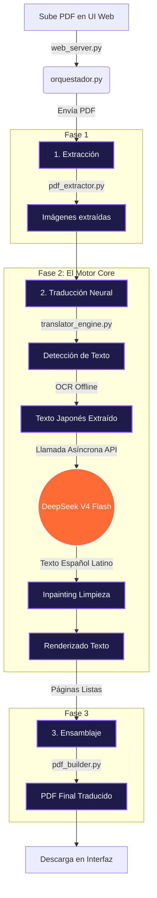

# Traductor de Manga Local (Japonés a Español Latino)


Una herramienta automatizada de código abierto para escanear, reconocer, traducir y renderizar mangas desde su idioma original (japonés) al español latino de forma desatendida. 

Este proyecto combina un procesamiento de imágenes y reconocimiento óptico de caracteres (OCR) ejecutado de forma 100% **local** (ideal para NAS o servidores con CPU o GPU integrada) con la poderosa y económica API de **DeepSeek V4 Flash** encargada exclusivamente de la traducción del texto.

## Características Principales
- **Extracción Inteligente:** Toma un archivo PDF (o una carpeta con imágenes) y lo prepara para traducción sin comprimirlo excesivamente.
- **OCR Local:** Utiliza [manga-image-translator](https://github.com/zyddnys/manga-image-translator) para detectar los globos de diálogo y extraer el texto en japonés, sin costo de API.
- **Inpainting Automático:** Limpia los globos de texto originales en la imagen, regenerando el fondo cuando el texto está encima de dibujos.
- **Traducción Contextual:** Envía todos los textos de una página a la vez al modelo elegido (por defecto `deepseek-v4-flash`) para que traduzca con el contexto completo, aplicando un tono de manga natural y coloquial. Es **compatible con cualquier IA que soporte la API de OpenAI** (Anthropic, Gemini, Llama local, etc).
- **Validación Anti-Asiática Estricta:** Incorpora una capa de seguridad para rechazar y reintentar si el modelo intenta devolver caracteres asiáticos en la traducción.
- **Renderizado Dinámico:** Redibuja el texto en español sobre la imagen ajustando la fuente.
- **Ensamblaje a PDF:** Reconstruye la obra completa y genera un archivo final `_traducido.pdf` conservando la calidad de lectura original.
- **Interfaz 100% Offline:** Las fuentes tipográficas están **autohospedadas** (`src/static/fonts/`, licencia OFL); la web no depende de Google Fonts ni de ninguna CDN externa, ideal para un NAS sin salida a internet.

---

## ⚙️ Arquitectura y Flujo de Procesamiento

El código está diseñado como un **pipeline asíncrono página por página**: los pesados modelos de IA se cargan **una sola vez** en memoria (patrón Singleton) y se reutilizan, y cada página se procesa por completo (detección → OCR → traducción → render) **liberando su memoria antes de pasar a la siguiente**. Esto acota el uso de RAM en tomos largos, algo crítico en hardware limitado como un NAS. Las imágenes intermedias se escriben en disco de forma temporal y se purgan automáticamente al finalizar.



### Módulos del Sistema:

1. **`web_server.py` (Interfaz):** Servidor FastAPI que monta la interfaz gráfica web y enruta la subida del PDF hacia el orquestador en un proceso en segundo plano (para no bloquear la página web).
2. **`orquestador.py` (Director):** El cerebro organizativo. Carga las configuraciones, inicializa la inteligencia artificial una única vez (patrón Singleton) para que no haya que recargar los pesados modelos a la memoria RAM por cada página, y llama en orden a las herramientas de extracción, traducción y ensamblaje.
3. **`pdf_extractor.py` (Fase de Ingesta):** Descomprime el PDF del usuario y guarda temporalmente cada página como una imagen JPG/PNG (200-300 DPI) para que la IA la pueda observar.
4. **`translator_engine.py` (Motor de Traducción):** La joya de la corona. Mantiene vivos los algoritmos de detección visual y OCR, inyecta nuestra función propia que conecta con DeepSeek a la mitad del proceso, valida la calidad de la traducción, usa el algoritmo *LaMa* para borrar los textos originales de la imagen, e imprime los textos en español en los globos.
5. **`pdf_builder.py` (Fase de Cierre):** Agarra todas las imágenes generadas por el motor y las vuelve a coser en un PDF de alta calidad, listo para que te lo lleves.

---

## Requisitos Previos

- Python 3.11 o superior (si se instala de forma manual).
- Cuenta y API Key de **DeepSeek**.
- Docker (opcional, pero fuertemente recomendado para despliegues en servidores NAS).

---

## 🐳 Instalación Recomendada: Docker Desktop (Windows / Mac / NAS)

Debido a que el motor de IA (`manga-image-translator`) utiliza librerías nativas antiguas y pesadas (PyTorch, numpy 1.26, OpenVINO, pydensecrf) que **carecen de instaladores pre-compilados para versiones recientes de Python (como 3.14)**, intentar ejecutar este proyecto de forma nativa en Windows o WSL a menudo resulta en errores catastróficos del compilador de Rust o C++.

Para evitar dolores de cabeza, **la forma oficial y recomendada de usar MangaScan AI es a través de Docker Compose**. El contenedor ya incluye Python 3.11 pre-configurado y todas las dependencias compiladas.

### Pasos con Docker Desktop (o Servidor Linux):

1. **Clonar el repositorio:**
   ```bash
   git clone https://github.com/Holkeano526/mangascan.git
   cd mangascan
   ```

2. **Configurar tu API Key:**
   Crea un archivo `.env` en la raíz del proyecto (junto a `docker-compose.yml`) con tu clave de DeepSeek. Docker Compose la inyecta automáticamente en el contenedor:
   ```env
   DEEPSEEK_API_KEY=sk-tu_api_key_aqui
   ```
   > ⚠️ **No** escribas la clave directamente en `docker-compose.yml`: ese archivo está rastreado por git y expondría tu clave al subirlo a GitHub.

3. **Levantar el proyecto:**
   Abre una terminal en la carpeta del proyecto y ejecuta:
   ```bash
   docker compose up --build -d
   ```
   *(Docker descargará todo el entorno, compilará las librerías necesarias de IA y lanzará el servidor en segundo plano).*

4. **¡A Traducir!**
   Abre tu navegador web y entra a **[http://localhost:8000](http://localhost:8000)**. 
   Verás la interfaz gráfica de MangaScan AI. Sube tu PDF, observa el progreso en tiempo real y descarga el resultado.

> **💡 Nota sobre la Caché:** La configuración de `docker-compose.yml` ya está diseñada para guardar de forma permanente los gigabytes de modelos de IA en la carpeta `./config` de tu disco duro. Así no tendrás que volver a descargarlos cada vez que reinicies el contenedor.

---

## 💻 Instalación Local Avanzada (Bajo tu propio riesgo)

Si eres un desarrollador avanzado usando **Linux nativo con Python 3.11 estrictamente** (No funciona bien en Windows nativo ni Python >=3.12 sin compilación manual cruzada):

1. **Crear y activar el entorno virtual:**
   ```bash
   python3.11 -m venv venv
   source venv/bin/activate
   ```

2. **Instalar dependencias:**
   ```bash
   pip install --upgrade pip
   pip install -r requirements.txt
   ```

3. **Configurar API Key:**
   Crea un archivo llamado `.env` en la **raíz del proyecto** (la misma carpeta donde está este README) con el siguiente contenido:
   ```env
   DEEPSEEK_API_KEY="sk-tu_api_key_aqui"
   ```
   Alternativamente, puedes exportar la variable de entorno directamente en tu terminal:
   ```bash
   export DEEPSEEK_API_KEY="sk-tu_api_key_aqui"
   ```

## Uso (Web App Premium)

El sistema ahora cuenta con una **interfaz web premium y responsiva** alojada localmente, que incluye:
- Animaciones fluidas, modo oscuro y diseño de cristal (Glassmorphism).
- Botón de cancelación inmediata para interrumpir la subida de archivos grandes.
- Modal de confirmación para pre-visualizar el archivo y activar el **Modo Rápido** (Fast Mode) que desactiva el redibujado de cajas, acelerando enormemente el proceso.
- Seguimiento en tiempo real con consola integrada y barra de progreso.

### 1. Arrancar el Servidor
Activa tu entorno virtual y arranca el backend de FastAPI:

```bash
# Activar entorno
source venv/bin/activate

# Arrancar la web
uvicorn src.web_server:app --host 0.0.0.0 --port 8000
```

### 2. Usar la Interfaz
1. Abre tu navegador y dirígete a la IP de tu NAS (o `http://localhost:8000` si estás en la misma máquina).
2. Arrastra y suelta tu manga PDF.
3. Observa la terminal en vivo y la barra de progreso mientras el motor de traducción trabaja.
4. Una vez finalice, haz clic en el botón de descarga iluminado para llevarte tu PDF traducido.

### Ejecución en NAS (OpenMediaVault) con Docker Compose
Si prefieres correrlo de manera aislada (ideal para tu NAS), he incluido un `docker-compose.yml` pre-optimizado para OpenMediaVault, que maneja tus permisos (PUID/PGID) y enruta los modelos pesados a una carpeta persistente para que no saturen tu disco.

```bash
# Simplemente levanta el contenedor en segundo plano
docker-compose up -d
```
Accede a `http://IP_DE_TU_NAS:8000` y listo.

---

## 🛠️ Personalización Avanzada

### Usar otras Inteligencias Artificiales (Anthropic, Gemini, OpenAI, Locales)
MangaScan AI está diseñado utilizando la estructura estándar de mensajes de OpenAI. Esto significa que **puedes usar prácticamente cualquier otra IA del mercado** simplemente apuntando la URL base hacia otro proveedor.

Para hacerlo, define las siguientes variables en tu archivo `.env` (nunca la clave en `docker-compose.yml`, que se sube a git):
```env
# Por defecto es "https://api.deepseek.com/chat/completions"
DEEPSEEK_API_URL="https://api.openai.com/v1/chat/completions"
# Coloca aquí tu clave del nuevo proveedor
DEEPSEEK_API_KEY="sk-tu_nueva_clave"
# El nombre exacto del modelo que vayas a usar
DEEPSEEK_MODEL="gpt-4o-mini"
```
*(Nota: Si usas servidores locales como LM Studio o Ollama, tu URL sería algo como `http://localhost:1234/v1/chat/completions`)*

### Modificar el Prompt de la Inteligencia Artificial
El comportamiento del modelo (tono, estilo y reglas de traducción) puede ser modificado a tu gusto editando el archivo `src/translator_engine.py`. Busca la constante `SYSTEM_PROMPT` y ajusta las instrucciones para que el modelo hable de manera más formal, use jerga específica o mantenga honoríficos japoneses.

### Configuración de Globos de Texto (Sensibilidad)
Por defecto, el sistema viene configurado con un "Punto Medio" quirúrgico para encontrar textos en burbujas inusuales (como formas hexagonales) y textos dispersos. Si notas que ignora textos muy claros o une párrafos que no debería, puedes modificar los umbrales de detección.
Estos valores viven en `src/translator_engine.py`, dentro del método `_get_config` (busca `cfg.detector.text_threshold` y `cfg.detector.box_threshold`). La configuración se cachea y se comparte entre las fases de detección y renderizado, así que solo hay un lugar que editar y ambas fases quedan siempre sincronizadas automáticamente.

> **Nota:** Para entender más sobre cómo estos valores afectan el tamaño y fusión de las cajas de texto (por ejemplo usando `unclip_ratio`), te recomendamos consultar la [documentación oficial de manga-image-translator](https://github.com/zyddnys/manga-image-translator).

---

## ⚠️ Limitaciones Conocidas

* **Idiomas Soportados:** El modelo de OCR (`48px`) está enfocado principalmente en Japonés, Coreano, y algunas variantes de Chino. **No soporta de manera confiable todos los idiomas asiáticos** (ejemplo: puede arrojar basura o caracteres mezclados al intentar leer Tailandés).
* **Textos Muy Juntos:** Dependiendo de la diagramación del manga, el sistema de detección puede fusionar diálogos adyacentes si los globos están excesivamente pegados. Si esto ocurre, revisar la sección de configuración de globos.
* **Archivos Extra Grandes:** Asegúrate de que el disco del NAS tenga espacio suficiente, ya que la extracción a PNG de PDFs de más de 200 MB genera una cantidad inmensa de datos temporales.

## 📂 Arquitectura Interna del Pipeline

El `src/orquestador.py` procesa el tomo **página por página** para acotar el uso de memoria. El flujo es:

1. **Extracción (PyMuPDF, una vez):** Descompone el PDF de entrada en imágenes PNG de alta resolución (carpeta `raw/`).
2. **Por cada página** (detección → traducción → render, liberando la RAM de esa página al terminar):
   - **Detección y OCR local:** localiza las cajas de los globos y extrae los caracteres japoneses.
   - **Traducción:** unifica los textos de la página, los envía en JSON a DeepSeek y recupera el español. Incluye mitigación de `HTTP 429` (Exponential Backoff) y validación anti-asiática con reintentos.
   - **Inpainting & Render:** borra el texto original con la máscara detectada y dibuja la fuente en español (carpeta `render/`). Las páginas sin texto detectado se copian tal cual.
3. **Reconstrucción final (una vez):** cose las imágenes de `render/` en el `.pdf` final con la coletilla `_traducido`.

*Al finalizar, si el flag `--debug` no está activo, se purgan automáticamente los ficheros intermedios (`raw/`, `render/`); además, el servidor web borra el PDF de entrada para no llenar el disco del NAS.*

---

## ⚠️ Consideraciones de la IA de Traducción
El sistema de escaneo omite deliberadamente los **SFX (Efectos de sonido)** que estén incrustados en el arte de manera orgánica, ya que la red neuronal de `manga-image-translator` se entrena sobre globos de texto convencionales. En estos casos, las onomatopeyas se mantienen intactas tal cual como la versión japonesa original.

---
**Desarrollado para el procesamiento masivo y desatendido en servidores NAS y HomeLabs.**

## Licencia

Este proyecto se distribuye bajo la licencia **GNU General Public License v3.0 (GPL-3.0)**. Esto significa que cualquiera puede usar, modificar y distribuir el código libremente, siempre y cuando cualquier proyecto derivado también sea de código abierto bajo esta misma licencia. Consulta el archivo \LICENSE\ para más detalles.
